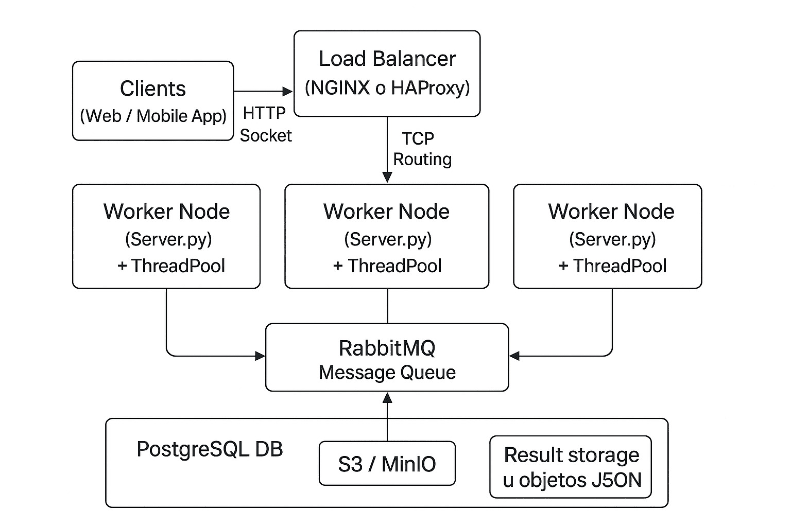

# 🧩 Arquitectura Distribuida con Python y Sockets

Este proyecto implementa una **arquitectura distribuida básica** utilizando **sockets TCP**, **thread pools** y una **cola de mensajes simulada**, emulando el comportamiento de **RabbitMQ**.  
La solución está diseñada con una estructura **modular, escalable y extensible**, apta para integrarse con balanceadores como **NGINX** o **HAProxy**, y con sistemas distribuidos de almacenamiento como **PostgreSQL** o **MinIO/S3**.

---

## 📘 Diagrama del Sistema



### Descripción de componentes

- **Clientes (Web / CLI / Mobile):** envían tareas al sistema mediante conexión TCP.
- **Balanceador (NGINX o HAProxy):** distribuye las solicitudes hacia los nodos de procesamiento.
- **Worker Nodes (`server.py`):** servidores concurrentes que procesan tareas usando un pool de threads.
- **RabbitMQ simulado:** implementado con `queue.Queue` para gestionar el flujo de mensajes.
- **Almacenamiento:**
  - **SQLite:** persistencia local de resultados y logs.

---

## ⚙️ Requisitos Previos

- Python **3.9+**
- Librerías estándar: `threading`, `socket`, `queue`, `json`, `random`, `sqlite3`

---

## 🧠 Estructura del Proyecto

```
.
├── client.py
├── server.py
├── diagrama.jpg
└── README.md
```

---

## 🚀 Ejecución en Entorno Local

### 1. Clonar el repositorio

```bash
git clone https://github.com/mgalim/sistema-distribuido.git
cd sistema-distribuido
```

---

### 2. Iniciar el servidor (worker principal)

```bash
python server.py
```

Por defecto, el servidor escucha en `127.0.0.1:5000`.  
Podés lanzar múltiples instancias en distintos puertos para simular varios nodos:

```bash
python server.py 5000
python server.py 5001
python server.py 5002
```

Cada instancia gestionará su propia cola y base de datos local (`resultados.db`).

---

### 3. (Opcional) Balanceo de carga con NGINX

Archivo de configuración mínimo (`nginx.conf`):

```nginx
stream {
    upstream distributed_workers {
        server 127.0.0.1:5000;
        server 127.0.0.1:5001;
    }

    server {
        listen 6000;
        proxy_pass distributed_workers;
    }
}
```

Luego, iniciá NGINX y conectate a `localhost:6000` desde el cliente.

---

### 4. Ejecutar el cliente

```bash
python client.py
```

El cliente enviará cinco tareas al servidor y mostrará las respuestas procesadas por los workers.

---

## 🧩 Notas Técnicas

- El servidor puede ejecutar múltiples hilos de trabajo en paralelo para procesar tareas concurrentes.
- El diseño facilita la evolución hacia una arquitectura **Master/Worker real** o integración con **mensajería externa**.
- El uso de `127.0.0.1` garantiza seguridad local evitando exposición externa (más seguro que `0.0.0.0`).

---

## 👨‍💻 Autor

**Practica Formativa Obligatoria N.º 3 — Programación sobre Redes**  
Desarrollado por **Marcelo Galimberti**  
**IFTS N.º 29 | 2025**
