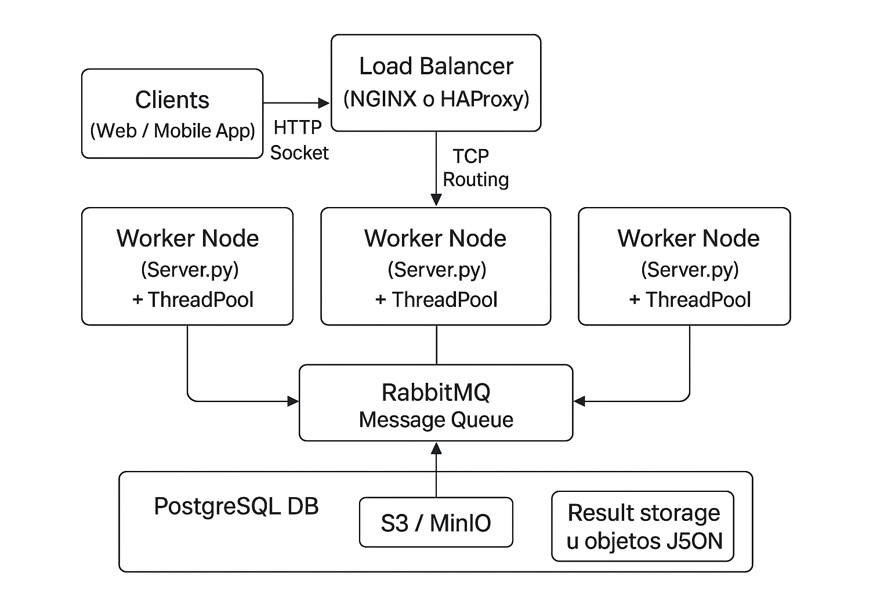

# 🧩 Arquitectura Distribuida con Python y Sockets

Este proyecto implementa una arquitectura distribuida básica utilizando **sockets TCP**, **thread pools**, y una **cola de mensajes simulada** que emula el funcionamiento de **RabbitMQ**.  
La solución está diseñada con una estructura escalable y modular, fácilmente integrable con balanceadores como **NGINX** o **HAProxy**, y sistemas distribuidos de almacenamiento como **PostgreSQL** y **S3/MinIO**.

---

## 📘 Diagrama del Sistema



**Descripción de componentes:**

- **Clientes (Web / Mobile App):** envían tareas al sistema.
- **Balanceador (NGINX o HAProxy):** distribuye conexiones TCP a los nodos workers.
- **Worker Nodes (Server.py):** servidores concurrentes con pool de threads que procesan tareas.
- **RabbitMQ (simulado con `queue.Queue`):** cola de mensajes que orquesta tareas y resultados.
- **Almacenamiento Distribuido:**
  - **PostgreSQL DB:** registro de resultados y logs.
  - **S3 / MinIO:** almacenamiento de archivos u objetos grandes.

---

## ⚙️ Requisitos previos

- Python **3.9+**
- Librerías estándar (`threading`, `socket`, `queue`, `json`, `random`)

---

## 🧠 Estructura del proyecto

```
.
├── client.py
├── server.py
├── diagrama.png
└── README.md
```

---

## 🚀 Ejecución en entorno local

### 1. Clonar el repositorio

```bash
git clone https://github.com/mgalim/sistema-distribuido.git
cd sistema-distribuido
```

### 2. Iniciar uno o más servidores (workers)

```bash
python server.py
```

Por defecto, escucha en `0.0.0.0:5000`.  
Podés lanzar múltiples instancias en distintos puertos asi:

Ejemplo:

```bash
python server.py 5000
python server.py 5001
python server.py 5002
```

---

### 3. (Opcional) Configurar NGINX como balanceador

Archivo `nginx.conf` mínimo:

```nginx
stream {
    upstream distributed_workers {
        server 127.0.0.1:5000;
        server 127.0.0.1:5001;
    }

    server {
        listen 6000;
        proxy_pass distributed_workers;
    }
}
```

Inicia NGINX y conéctate luego a `localhost:6000` desde el cliente.

---

### 4. Ejecutar el cliente

```bash
python client.py
```

El cliente enviará cinco tareas al servidor y recibirá las respuestas procesadas por los workers.

---

## 👨‍💻 Autor

Practica formativa obligatoria nº 3 - Programación sobre redes, desarrollado por **Marcelo Galimberti**  
IFTS nº 29 | 2025
